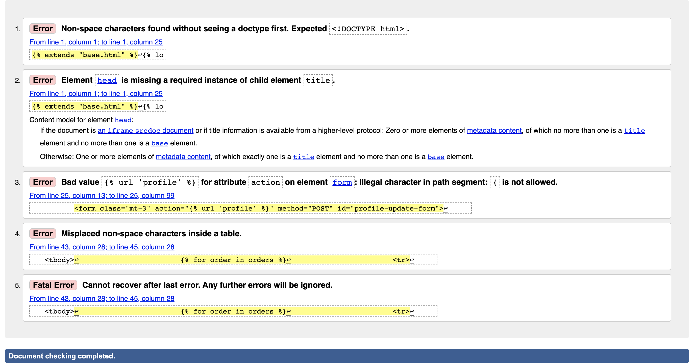
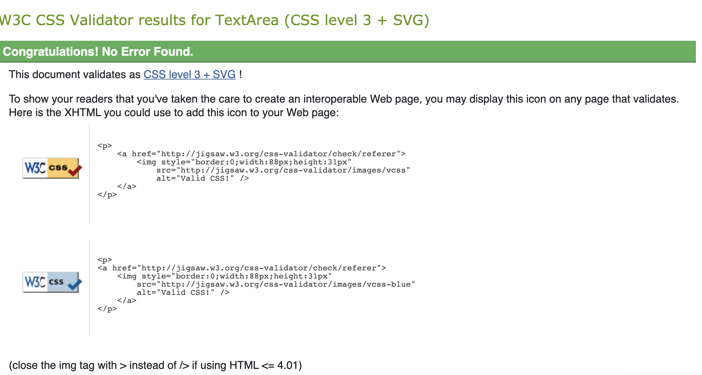
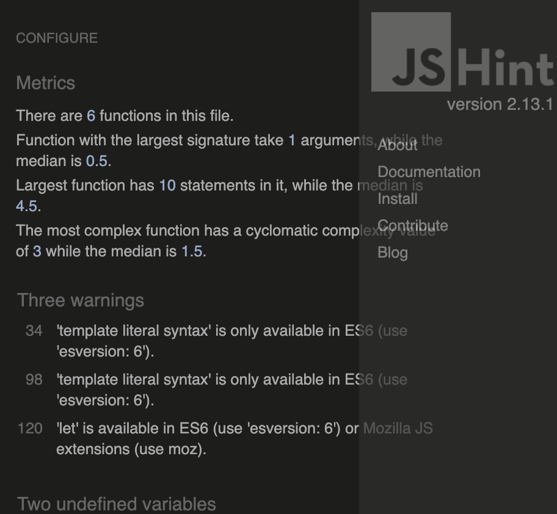
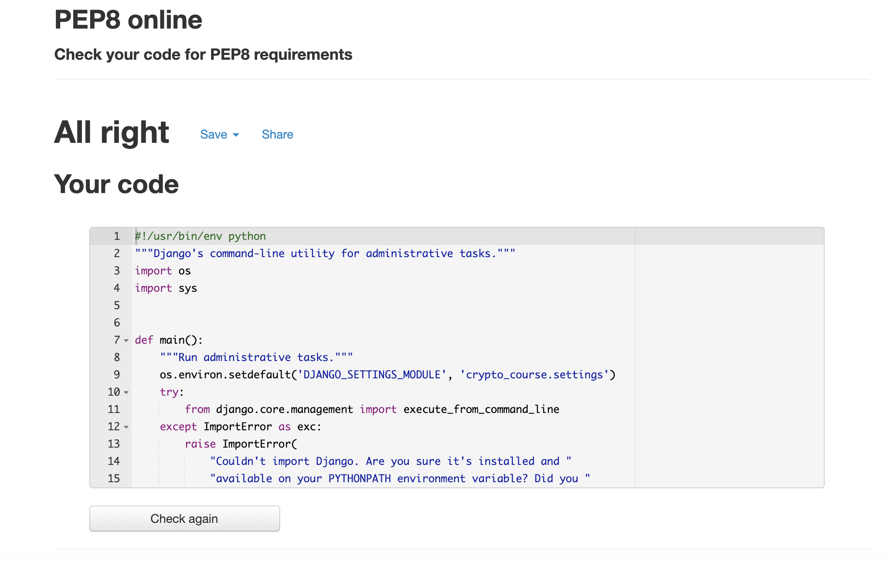
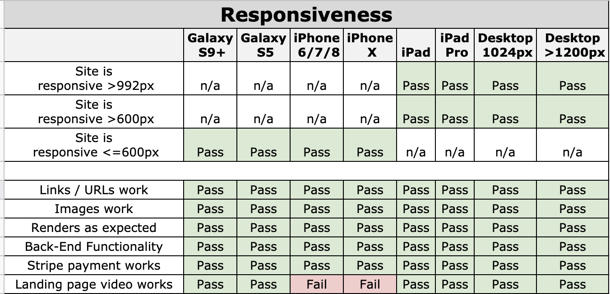

# Crypto Course Testing

- [Validation](#validation)
  * [W3 HTML](#w3-html)
  * [W3 CSS](#w3-css)
  * [JavaScript](#javascript)
  * [Python](#python)
  * [Google Lighthouse Audit](#google-lighthouse-audit)
- [Responsive Device & Browser Testing](#responsive-device--browser-testing)
  * [Responsiveness](#responsiveness)
  * [Browser Compatibility](#browser-compatibility)
- [Testing User Stories](#testing-user-stories)
- [Issues I had to overcome](#issues-i-had-to-overcome)
- [Issues still to overcome](#issues-still-to-overcome)

## Validation

### W3 HTML

I validated the HTML with [W3C Validation Service](https://validator.w3.org/). All the errors shown were related Django Templating not being recognized by W3C:
- Warning: Consider adding a lang attribute to the html start tag to declare the language of this document.
- Error: Non-space characters found without seeing a doctype first. Expected <!DOCTYPE html>.
- Warning: This document appears to be written in English. Consider adding lang="en" (or variant) to the html start tag.
- Error: Element head is missing a required instance of child element title.
- Error: Bad value .
- Error: The aria-labelledby attribute must point to an element in the same document.

All the htmls document were checked :
- [x] base.html
- [x] home.html
- [x] products.html
- [x] product_detail.html
- [x] add_product.html
- [x] edit_product.html
- [x] blog.html
- [x] blog_detail.html
- [x] add_blogpost.html
- [x] edit_blogpost.html
- [x] add_comment.html
- [x] edit_comment.html
- [x] bag.html
- [x] checkout.html
- [x] checkout-success.html
- [x] contact.html
- [x] profile.html
- [x] 404.html

### W3 CSS

I validated the CSS with the [W3 Validation Service](https://jigsaw.w3.org/css-validator/) and it found no errors.

### JavaScript

I validated the JavaScript with [JSHint](https://jshint.com/).

 

### Python

I validated the Python code was PEP 8 compliaint via the [PEP8 Online](http://pep8online.com/) and [SNYK](https://snyk.io/product/open-source-security-management/) and found no errors.

### Google Lighthouse Audit

I used Google's lighthouse audit in the Chrome DevTools to test the website conforms positively with Google's performance metrics.

After running the audit, the site received the below scores;

All the tests were passed on Google Lighthouse.

## Responsive Device & Browser Testing

This website was developed using the Mobile First philosophy.
To test the responsiveness of the site I used [Chrome DevTools](https://developers.google.com/web/tools/chrome-devtools).

### Responsiveness

To ensure responsive design, I used bootstrap, CSS and media queries to ensure all site pages resized responsively for all mainstream device viewports.

The landing video seems to have display issues on iphone devices. This may be due to the fact that iphone devies does not support the mp4 format of the video.

### Browser Compatibility
The website has been manually tested using the following browers.
- Chrome 
- Edge
- Firefox
- Safari

## Testing User Stories

**1. Viewing and Navigation**

a. As a shopper I want to be able understand the purpose of the website and have direct access to view available products.
* The site acted as expected and displayed the landing video properly with link to products page working fine.

b. As a shopper I want to be able to browse and view the product list.
* The site acted as expected, displayed all the product cards accordingly as well as the button and code 200 in the terminal.

c. As a shopper I want to be able to check individual product details such as price, size, category and description and rating.
* The site acted as expected, displayed all product data correctly.

d. As a shopper I want to be able to easily go through my bag content and total cost of my order.
* The site acted as expected and displayed correct informations in the bag toast as well as the bag template. 

e. As a shopper I want to be able to read blog posts and comments.
* Site acted as expected and displayed blog posts correctly and its comments as well. 

**2. Registration and Accounts**

a. As a site user I want to be able to register for an account.
* Site acted as expected, allowed all registration steps without trouble and creates a user profile both in the database and on the website. Newly registered users recieve confirmation email to confirm success of registraion.

b. As a site user I want to be able to login or logout of my account.
* Site acted as expected in both scenario and allowed the user to log in and log out without trouble.

c. As a site user I want to be able to recover my password if necessary.
* Site acted as expected and the user password was changed safely.

e. As a site user I want to be able to have a customizable profile.
*Site acted as expected and displayed the custom profile template as well as a functional user details form.

f. As a site user I want to be able to create a blog comment.
* Result: Site acted as expected, after filling out add comment form, new comment display under blog post.

g. As a shopper I want to be able to contact customer's support.
* Site acted as expected and sent a confirmation email to the user as well as the admin after contact form is filled out and sumbitted succesfully.

h. As a site user I want to be able to check my order history.
* Result: Site acted as expected and displayed all order history informations and functional links directing to the previous confirmation screens of each orders. 

**3. Sorting and Searching**

a. As a shopper I want to be able to sort products by categories, alphabetical order or price. 
* After Navigating to All products page in the navigation bar and sorted products by category, Alphabetical order, reverse Alphabetical order and price using the selector. Site acted as expected and sorted all products according to the selection made. 

b. As a shopper I want to be able to search for a product by name, category or description .
* When the search bar is used to conduct various queries by name, words present in descriptions and category to ensure that according products were displayed. Site acted as expected and displayed the correct products according to the search effected.

**4. Purchasing and Checkout**

a. As a shopper I want to be able to view items in my shopping bag. .
* Added a product to the bag and checked that it was correctly displayed in the bag toast with no bugs then clicked on the 'Secure Chekout' button to navigate to the bag page. Verified if all product data shows and that the shipping cost and product cost add up correctly. The site acted as expected and displayed correct informations in the bag toast as well as the bag template. Showed Code 200 in the terminal.
:

b. As a shopper I want to be able to modify the quantity of items in the bag before checkout. 
* Navigated to the bag template after adding a few items. Changed the amount of items for each by using the selector. Tested the remove option to ensure that the item was removed from the bag. Checked if the global cost and shipping was updated. The site acted as expected and updated the number of items as well as the global and shipping costs. Shows 200 code in the terminal.

c. As a shopper I want to be able to buy products by card safely.

* Navigated as a registered user to the checkout page from the bag page by clicking on the checkout button. Checked if the delivery address was pre-filled from the user details given previously. Intentioanlly entered wrong card details to check if the payment would fail and then filled the card details with the Stripe test card details. Checked on Stripe account  to see if the webhooks were working by viweing  the webhook attempts in the developer panel. Site acted as expected and displayed error message when the payment failed. It displayed the loading spinner while the payment was being processed and all webhook passed the tests in the Stripe webhook panel.

d. As a shopper I want to be able to view an order confirmation after the purchase.

* Used the Stripe card details to test a successful payment and waited after the loading spinner to check if the order confirmation page was loading with all order and shipping details. Site acted as expected and displayed the order confirmation page right after the loading spinner with all correct order informations.

e. As a shopper I want to be able to receive a confirmation email after checkout .

* Site acted as expected in both scenarios and sent the confirmation email with all correct order informations.

**5. Admin and Store Management**

a. As an admin I want to be able to add a product to the store.

* Logged in as a superuser and navigated to the product management page. Filled all required fields for different products, checked if the size section was disabled if the product does not have sizes and checked if the image field allowed to select an image from my computer and clicked the submit button. Site acted as expected and added a new product to the database and the store with or without sizes and image.

b. As an admin I want to be able to edit a product from store .

* Navigated as a superuser to the edit form by clicking on the Edit button. Checked if the form was filled with previous data, and tried to change a few fields including the image then clicked submit. Site acted as expected and saved all changed product informations to the database and the website.

c. As an admin I want to be able to to delete a product from store .
* Navigated as a superuser to the delete modal by clicking on the delete button. Clicked on the confirm the delete modal. Site acted as expected and deleted the product from the database and the website.

d. As an admin I want to be able to create a blog post for the blog .

* Logged in as a superuser and navigated to the blog management page section. Filled all required fields and checked if the image field allowed to select an image from my computer by clicking and selecting an image and clicked the submit button. Site acted as expected and added a new blog post to the database and the website.

e. As an admin I want to be able to edit a blog post.

* Navigated as a superuser to the edit form by clicking on the Edit button. Checked if the form was filled with previous data, and tried to change a few fields including the image then clicked submit. Site acted as expected and saved all changed blog post informations to the database and the website.

f. As an admin I want to be able to delete a blog post .

* Navigated as a superuser to a blog post page and clicked on the delete button. Confirmed that I want to delete the post by clicking delete again in the modal.Site acted as expected and deleted the blog post froö the database and the website.

g. As an admin I want to be able to be notified when a customer send a query through the contact form.

* When testing locally: Navigated to the contact page, filled the contact form and clicked send then I looked into the Gitpod terminal to check if the contact form informations were sent to the admin email and correctly displayed. Site acted as expected and displayed the email with all the contact form information in the Gitpod terminal. When tested on heroku, emails were sent to the store gmail account containing the customer's messages and details.

**6. Stripe**

To test the webhooks as well as the payment process, I used the Stripe testing card numbers:

* No authentication (default U.S. card): 4242 4242 4242 4242.
* Authentication required: 4000 0025 6000 3184.

The payment method and webhook behaved as expected and were both successful.

## Issues I had to overcome
* Database - After deployment to Heroku and connecting to Posrgres and AWS to store my static and media files. I had trouble editing and updating the site as no static files or media were showing locally during code refactoring on Gitpod. To fix this issue, a fellow memeber on Slack has suggested that I commented out the ``DEBUG = 'DEVELOPMENT' in os.environ`` in settings.py and set ``DEBUG = True``. This fixed the issue, and I was able to view all the product images and load any static files properly locally.

* Blog App - When creating the blog app, the migration did not work properly. I think this was because I had previously created a blog app and deleted the entire app because I was worried I might not have enough time to build another app to complete this project. After I finished setting up most of the functionality on the site, I decided to give this a go again and created a new blog app. As I was creating the blog app, I struggled to make any migrations. Everytime I tried to do it, there would be no chnage detected. This was because when I deleted the old blog app, some of the fiels were not deleted properly. Mentor Precious kindly offered me  help and fixed this issue for me.

## Issues still to overcome
* Quantity button - The minus quantity button in the bag is meant to be disabled when the quantity hits 1. Which works on small screens but does not work on larger screens. To fix this issue I would need to change the ID on the quantity-form to a class, and refactor the JavaScript to look for elements with the same class name and perform the appropriate actions. Due to time contrains, I will have to work on this at a later stage.

* When the quantity of a product is updated to a decimal number during checkout, the app crashes. Due to time contrains, I will have to work on this at a later stage.

* Landing page video - The landing page video does not work on iphones. It would disaply a static image as a background of the landing text instead of actually loading and playing the video at the back. This is because the brower on iphone does not support the large mp4 file. I have tried to add ``playsinline`` within the HTML for the video as suggested on slack, but did not fix the issue. I have yet to find a solution to this. This is out of my current knowledge and skills and I would like to do some further research on my part later.

* Not secure warning or Unsecure connection - This site has a "not secure" warning displayed on the browser address bar, this prevents me from using certain online tools for responsiveness testing. I manually tested these on several mobile devices and Google ChromeDevTools allowed responsiveness testing also. I had a look into the [django documentaion](https://docs.djangoproject.com/en/2.2/topics/security/#ssl-https) on how to enforce https with Django. Due to time contrains, I will have to work on this at a later stage.

